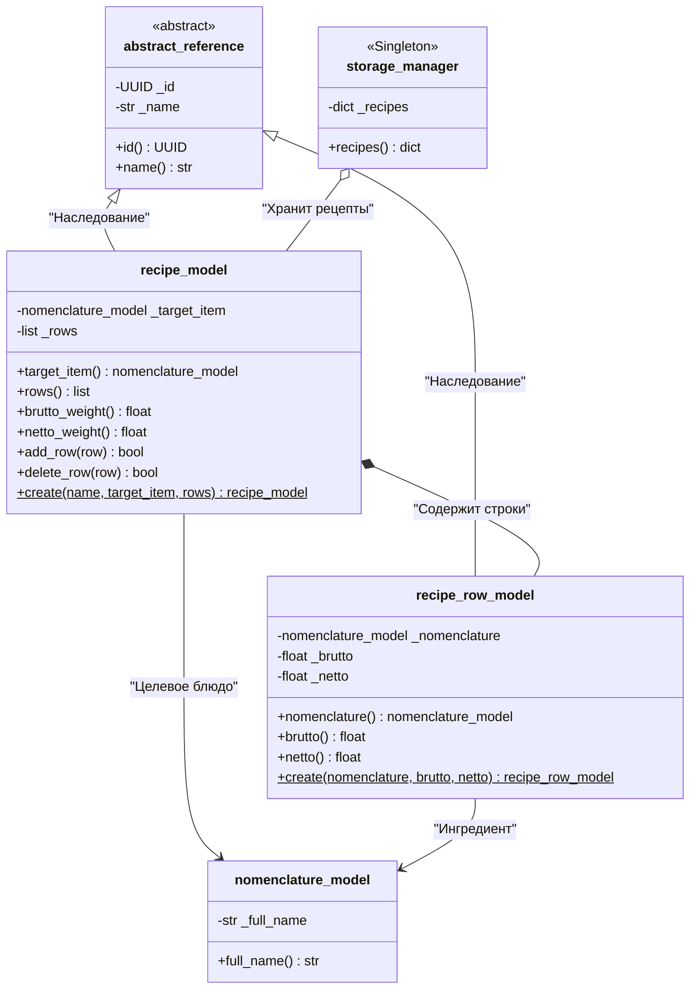

# UML-диаграмма моделей технологических карт (рецептов)

Диаграмма иллюстрирует архитектуру доменных моделей для хранения и расчета рецептов:
- Наследование от базового абстрактного класса `abstract_reference`.
- Композицию рецепта (`recipe_model`) и его строк (`recipe_row_model`).
- Связи с номенклатурой (`nomenclature_model`) для целевого блюда и ингредиентов.
- Хранение технологических карт в центральном репозитории `storage_manager`.

