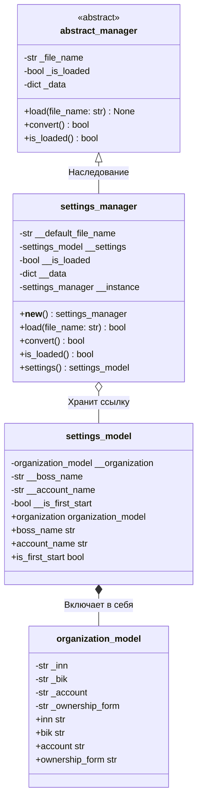

# UML-диаграмма: settings_manager

Диаграмма иллюстрирует архитектуру загрузчика настроек приложения:
- Наследование от базового абстрактного класса `abstract_manager`.
- Реализацию паттерна Singleton (`__new__`, `__instance`).
- Ассоциацию с моделью настроек `settings_model` и вложенной организацией `organization_model`.

