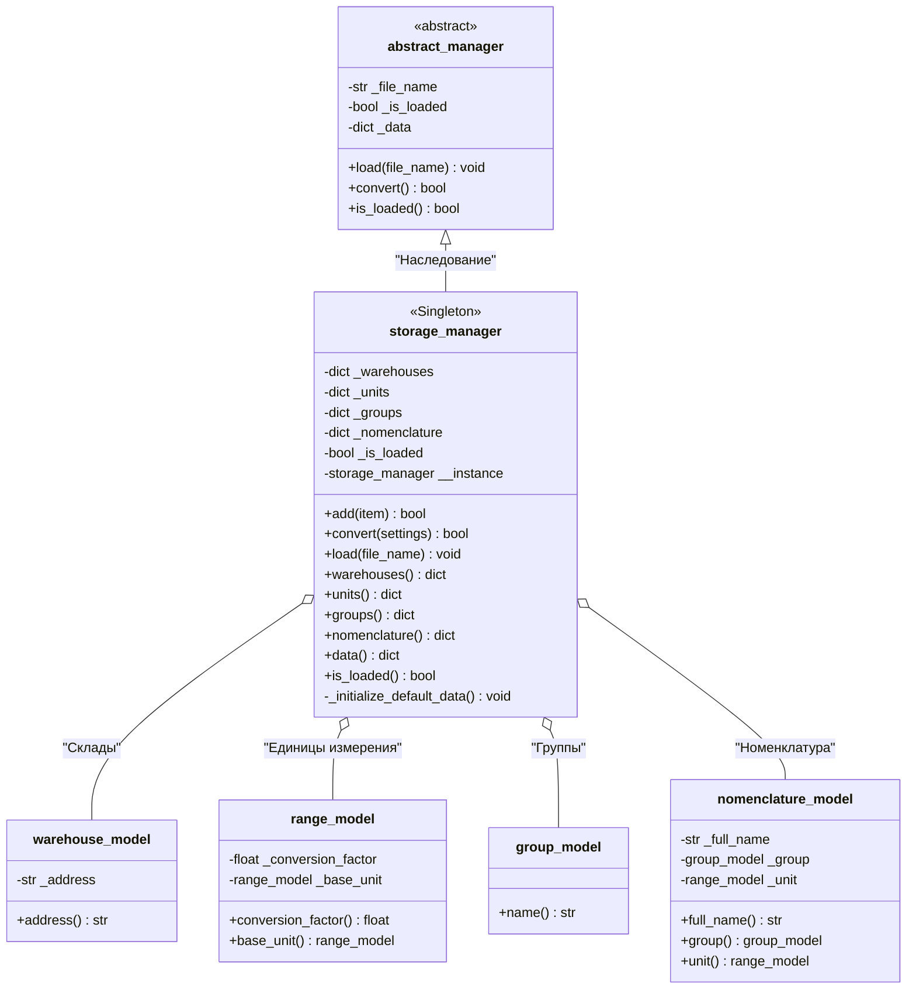

# UML-диаграмма: storage_manager

Диаграмма иллюстрирует архитектуру оперативного хранилища данных (In-Memory Repository):
- Наследование базового контракта `abstract_manager`.
- Реализацию шаблона проектирования `<<Singleton>>`.
- Хранение коллекций 4 доменных моделей.

